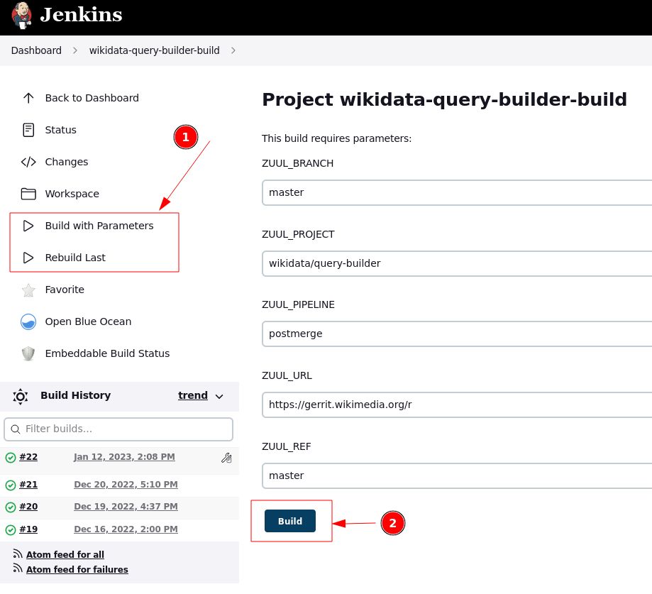

# query-builder
🔍️ A query builder for Wikidata SPARQL queries

## Test system

You can test this query builder in https://query-builder-test.toolforge.org

## Development

The following examples use `docker` and `docker-compose` to ease creating a level playing field for development but they are not essential to this project.

### Installation

```sh
# Set up and modify the environment variables according to your preferences
cp .env.example .env

# ensure the node user uses your user id, so you own created files
docker-compose build --build-arg UID=$(id -u) --build-arg GID=$(id -g) node

# install npm dependencies
docker-compose run --rm node npm i
```

### Running npm

```sh
docker-compose run --rm node npm
```

### Starting the development server

```sh
docker-compose up dev
```

### Running browser tests


#### To run Cypress browser tests locally:

Run: `docker-compose run --rm node npm run test:cy`

Note: If you wish to run cypress in the browser (and not in a headless mode) for debugging purposes, run `npm run cypress:interactive` locally (no docker).
If cypress is not starting please double check that the port in the command is the same as the one your dev server is running on.

### Chore: Updating dependencies

You can see which dependencies have new releases by first making sure your local dependencies are up-to-date by executing `npm ci` and then running `npm outdated`.
The query builder uses the latest full release of Wikit which works on Vue 2.6. For this reason we do not update any of the following packages till further notice:

- vue
- vuex
- vue-banana-i18n
- vite
- @vue/test-utils
- @vitejs/plugin-vue
- vue-template-compiler

All other dependencies should generally be updated to the latest version. If you discover that a dependency should not be updated for some reason, please add it to the above list. If a dependency can only be updated with substantial manual work, you can create a new task for it and skip it in the context of the current chore.

The recommended way to update dependencies is to collect related dependency updates into grouped commits; this keeps the number of commits to review manageable (compared to having one commit for every update), while keeping the scope of each commit limited and increasing reviewability and debuggability (compared to combining all updates in a single commit). For example, this can be one commit for each of:

    all ESLint-related dependency updates
    all Jest-related dependency updates
    all Vue-related dependency updates
    all PostCSS/Stylelint-related dependency updates
    npm update for all other dependency updates

Make sure that all tests still pass and building still works for every local commit using `npm run test`.

## Deploying to production
After merge:
1. [Login to Jenkins](https://integration.wikimedia.org/ci/login) with your LDAP credentials, the same you use to login to wikitech.
2. Trigger a build job for Query Builder in [Wikimedia CI](https://integration.wikimedia.org/ci/job/wikidata-query-builder-build/):



3. Once the patch in [deploy repo](https://gerrit.wikimedia.org/r/q/project:wikidata%252Fquery-builder%252Fdeploy) is created, force merge it:
   1. Give +2 to _both_ "Code Review" and "Verified".
   1. Click the "SUBMIT" button that then appears in the top right corner.
4. It will be [synced to production](https://gerrit.wikimedia.org/r/plugins/gitiles/operations/puppet/+/9d52148c28c3391d32f0b83c8762f70e8af1ad15/modules/profile/templates/wdqs/httpd-query.wikidata.org.erb#24) by the puppet agent which is set to run every 30 minutes.
